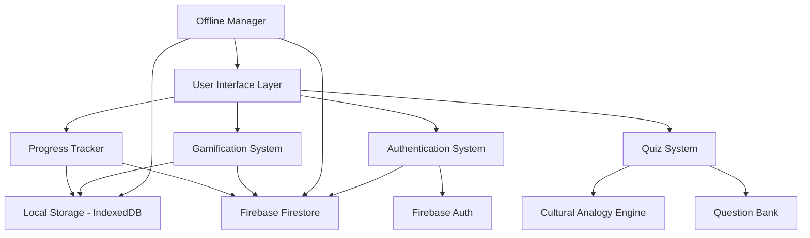

# Design Document: AWS Cloud Kigali

## Overview

AWS Cloud Kigali is a React-based single-page application (SPA) that provides an interactive, culturally relevant learning platform for AWS Cloud Practitioner exam preparation. The application uses a component-based architecture with local state management, offline-first capabilities, and a culturally adapted content delivery system.

The design emphasizes mobile-first responsiveness, fast loading times, and an engaging user experience through gamification. All technical concepts are explained using analogies familiar to Rwanda and West Africa, making cloud computing concepts more accessible to the target audience.

## Architecture

### High-Level Architecture



### Technology Stack

- **Frontend Framework**: React 18+ with functional components and hooks
- **State Management**: React Context API with useReducer for complex state
- **Authentication**: Firebase Authentication (Google Sign-In, Email/Password)
- **Backend/Database**: Firebase Firestore for user data synchronization
- **Styling**: CSS Modules with mobile-first responsive design
- **Offline Support**: Service Workers with Cache API
- **Data Persistence**: IndexedDB for offline data, Firestore for cloud sync
- **Build Tool**: Vite for fast development and optimized production builds
- **Testing**: Vitest for unit tests, React Testing Library for component tests

### Architectural Patterns

1. **Component-Based Architecture**: Modular React components with clear separation of concerns
2. **Container/Presenter Pattern**: Smart containers manage state, presentational components handle UI
3. **Offline-First**: Service worker caches assets and data for offline functionality
4. **Progressive Enhancement**: Core functionality works without JavaScript, enhanced with React

## Components and Interfaces

### Core Components

#### 1. Authentication System

**AuthProvider**
```typescript
interface AuthContextValue {
  user: User | null;
  loading: boolean;
  signInWithGoogle: () => Promise<void>;
  signInWithEmail: (email: string, password: string) => Promise<void>;
  signUp: (email: string, password: string, name: string) => Promise<void>;
  signOut: () => Promise<void>;
  isAuthenticated: boolean;
}

interface User {
  uid: string;
  email: string;
  displayName: string;
  photoURL?: string;
  createdAt: Date;
  lastLoginAt: Date;
}
```

**LoginScreen**
```typescript
interface LoginScreenProps {
  onLoginSuccess: () => void;
}

// Supports multiple authentication methods:
// - Google Sign-In (primary for ease of use)
// - Email/Password (for users without Google accounts)
// - Guest mode (local-only, no sync)
```

#### 2. Quiz System Components

**QuizContainer**
```typescript
interface QuizContainerProps {
  mode: 'practice' | 'exam';
  domain?: ExamDomain;
}

interface QuizState {
  currentQuestion: Question;
  questionIndex: number;
  userAnswers: Map<string, Answer>;
  timeRemaining?: number;
  isComplete: boolean;
}
```

**QuestionCard**
```typescript
interface QuestionCardProps {
  question: Question;
  onAnswer: (answerId: string) => void;
  showExplanation: boolean;
  selectedAnswer?: string;
}

interface Question {
  id: string;
  domain: ExamDomain;
  text: string;
  options: Option[];
  correctAnswerId: string;
  explanation: Explanation;
  difficulty: 'easy' | 'medium' | 'hard';
}

interface Option {
  id: string;
  text: string;
}

interface Explanation {
  correctReason: string;
  incorrectReasons: Map<string, string>;
  culturalAnalogy: CulturalAnalogy;
}
```

#### 2. Cultural Analogy Engine

**AnalogyProvider**
```typescript
interface CulturalAnalogy {
  concept: string;
  analogy: string;
  localExample: string;
  visualAid?: string;
}

interface AnalogyMapping {
  awsConcept: string;
  analogyType: AnalogyType;
  description: string;
}

type AnalogyType = 
  | 'mobile-money'
  | 'local-market'
  | 'moto-taxi'
  | 'coffee-farming'
  | 'water-distribution'
  | 'sacco'
  | 'electricity-grid';

function getAnalogyForConcept(concept: string): CulturalAnalogy;
function formatExplanationWithAnalogy(explanation: string, analogy: CulturalAnalogy): string;
```

#### 3. Progress Tracker Components

**ProgressDashboard**
```typescript
interface ProgressDashboardProps {
  userId: string;
}

interface UserProgress {
  totalQuestionsAttempted: number;
  correctAnswers: number;
  domainScores: Map<ExamDomain, DomainScore>;
  weakAreas: WeakArea[];
  examReadinessScore: number;
  studyStreak: number;
  lastStudyDate: Date;
}

interface DomainScore {
  domain: ExamDomain;
  questionsAttempted: number;
  correctAnswers: number;
  accuracy: number;
}

interface WeakArea {
  topic: string;
  accuracy: number;
  questionsAttempted: number;
}
```

**AnalyticsChart**
```typescript
interface AnalyticsChartProps {
  data: PerformanceData[];
  chartType: 'line' | 'bar' | 'radar';
}

interface PerformanceData {
  date: Date;
  score: number;
  domain?: ExamDomain;
}
```

#### 4. Gamification System

**GamificationManager**
```typescript
interface GamificationState {
  points: number;
  badges: Badge[];
  currentStreak: number;
  longestStreak: number;
  level: number;
  nextLevelPoints: number;
}

interface Badge {
  id: string;
  name: string;
  description: string;
  icon: string;
  earnedDate?: Date;
  criteria: BadgeCriteria;
}

interface BadgeCriteria {
  type: 'questions' | 'streak' | 'accuracy' | 'domain-mastery';
  threshold: number;
  domain?: ExamDomain;
}

function awardPoints(userId: string, points: number): void;
function checkBadgeEligibility(userId: string, progress: UserProgress): Badge[];
function updateStreak(userId: string, studyDate: Date): number;
```

#### 5. Offline Manager

**OfflineSync**
```typescript
interface OfflineManager {
  isOnline: boolean;
  pendingSync: SyncItem[];
  lastSyncDate: Date;
}

interface SyncItem {
  id: string;
  type: 'progress' | 'answer' | 'bookmark';
  data: any;
  timestamp: Date;
}

function cacheQuestions(questions: Question[]): Promise<void>;
function syncProgress(): Promise<SyncResult>;
function handleOfflineAnswer(questionId: string, answer: Answer): void;
```

## Data Models

### Question Bank Schema

```typescript
interface QuestionBank {
  questions: Question[];
  version: string;
  lastUpdated: Date;
}

interface Question {
  id: string;
  domain: ExamDomain;
  subdomain: string;
  text: string;
  options: Option[];
  correctAnswerId: string;
  explanation: Explanation;
  difficulty: 'easy' | 'medium' | 'hard';
  tags: string[];
  culturalContext: CulturalContext;
}

interface CulturalContext {
  primaryAnalogy: CulturalAnalogy;
  localExamples: string[];
  rwandanBusinessCase?: string;
}

type ExamDomain = 
  | 'cloud-concepts'
  | 'security-compliance'
  | 'technology'
  | 'billing-pricing';
```

### User Data Schema

```typescript
interface UserProfile {
  id: string;
  email: string;
  displayName: string;
  photoURL?: string;
  createdDate: Date;
  lastLoginDate: Date;
  preferences: UserPreferences;
  progress: UserProgress;
  gamification: GamificationState;
  bookmarks: string[]; // Question IDs
  syncStatus: 'synced' | 'pending' | 'conflict';
}

interface UserPreferences {
  language: 'en' | 'rw';
  studyReminders: boolean;
  reminderTime?: string;
  preferredDomains: ExamDomain[];
  offlineMode: boolean;
  accountType: 'google' | 'email' | 'guest';
}
```

### Analytics Schema

```typescript
interface AnswerRecord {
  id: string;
  userId: string;
  questionId: string;
  selectedAnswerId: string;
  isCorrect: boolean;
  timeSpent: number; // seconds
  timestamp: Date;
  mode: 'practice' | 'exam';
}

interface StudySession {
  id: string;
  userId: string;
  startTime: Date;
  endTime: Date;
  questionsAttempted: number;
  correctAnswers: number;
  domains: ExamDomain[];
  mode: 'practice' | 'exam';
}
```

## Correctness Properties

*A property is a characteristic or behavior that should hold true across all valid executions of a system—essentially, a formal statement about what the system should do. Properties serve as the bridge between human-readable specifications and machine-verifiable correctness guarantees.*


### Property 1: Question Domain Coverage
*For any* quiz session, questions presented should include representation from all four exam domains (Cloud Concepts, Security & Compliance, Technology, Billing & Pricing).
**Validates: Requirements 1.1**

### Property 2: Immediate Feedback on Answer Selection
*For any* answer selection by a user, the Quiz System should provide immediate feedback indicating whether the answer is correct or incorrect.
**Validates: Requirements 1.2**

### Property 3: Question Bank Distribution Ratios
*For any* question bank, the distribution of questions across domains should match the exam weightings: Cloud Concepts (35%), Security & Compliance (30%), Technology (25%), Billing & Pricing (10%) within a tolerance of ±2%.
**Validates: Requirements 1.3, 6.2**

### Property 4: Practice Mode Explanation Visibility
*For any* question answered in practice mode, the explanation should be immediately visible after the user submits their answer.
**Validates: Requirements 1.5**

### Property 5: Exam Mode Timing
*For any* quiz session in exam simulation mode, the system should enforce time constraints and track elapsed time.
**Validates: Requirements 1.6**

### Property 6: Cultural Analogy Presence
*For any* question explanation generated by the system, it should contain a cultural analogy component that references Rwanda/West Africa concepts.
**Validates: Requirements 2.1, 4.3, 6.3**

### Property 7: Concept-to-Analogy Mapping Correctness
*For any* AWS concept explanation, the Cultural Analogy Engine should map it to the appropriate analogy type (mobile money for billing, moto taxis for load balancing, coffee farming for CI/CD, water distribution for CDN, SACCO for shared responsibility, electricity grid for infrastructure, local markets for microservices).
**Validates: Requirements 2.2, 2.3, 2.4, 2.5, 2.6, 2.7, 2.8**

### Property 8: Local Context Integration
*For any* explanation generated, it should include references to Rwandan or West African businesses, infrastructure, or examples.
**Validates: Requirements 2.9, 8.1, 8.2**

### Property 9: Weak Area Identification
*For any* user with performance data, if their accuracy in a specific topic is below 70%, the Analytics Engine should identify and flag that topic as a weak area.
**Validates: Requirements 3.2**

### Property 10: Exam Readiness Score Calculation
*For any* user progress data, the exam readiness score should be calculated as a weighted average of domain accuracies using exam weightings, scaled to 0-100.
**Validates: Requirements 3.3**

### Property 11: Domain-Specific Performance Tracking
*For any* answered question, the performance metrics should be correctly attributed to the question's domain and reflected in domain-specific analytics.
**Validates: Requirements 3.4**

### Property 12: Immediate Metrics Update
*For any* completed question, the user's performance metrics (total attempted, correct answers, accuracy) should be updated before the next question is presented.
**Validates: Requirements 3.5**

### Property 13: Historical Data Persistence
*For any* study session, the session data (questions attempted, scores, timestamp) should be persisted and retrievable for historical analysis.
**Validates: Requirements 3.6**

### Property 14: Correct Answer Explanation Provision
*For any* answered question, the system should provide a detailed explanation of why the correct answer is correct.
**Validates: Requirements 4.1**

### Property 15: Incorrect Answer Explanation Provision
*For any* incorrectly answered question, the system should provide an explanation of why the selected answer is incorrect.
**Validates: Requirements 4.2**

### Property 16: Points Award for Correct Answers
*For any* correct answer submitted, the Gamification System should award points to the user's total score.
**Validates: Requirements 5.1**

### Property 17: Badge Eligibility Check
*For any* user progress update, if the user meets the criteria for a badge they haven't earned, the Gamification System should award that badge.
**Validates: Requirements 5.2**

### Property 18: Study Streak Tracking
*For any* user who studies on consecutive days, the streak counter should increment by 1 for each consecutive day, and reset to 1 if a day is skipped.
**Validates: Requirements 5.3**

### Property 19: Bookmark Addition
*For any* question that a user bookmarks, that question's ID should be added to the user's bookmark list and be retrievable later.
**Validates: Requirements 5.4**

### Property 20: Responsive UI Rendering
*For any* viewport size (mobile, tablet, desktop), the UI components should render without horizontal scrolling and maintain usability.
**Validates: Requirements 7.3**

### Property 21: Offline Quiz Functionality
*For any* quiz operation (loading questions, submitting answers, viewing explanations) when offline, the system should function using cached data without requiring network connectivity.
**Validates: Requirements 7.5**

### Property 22: Currency Display in RWF
*For any* monetary value displayed in the application, it should be formatted in Rwandan Francs (RWF) with appropriate currency symbol and formatting.
**Validates: Requirements 8.3**

### Property 23: Local Measurement Units
*For any* measurement or metric displayed, it should use units familiar to the local context (metric system, local terminology).
**Validates: Requirements 8.5**

### Property 24: Error Handling Coverage
*For any* user interaction that could fail (network request, data validation, storage operation), the system should catch the error and prevent application crash.
**Validates: Requirements 9.1**

### Property 25: Error Message Display
*For any* error that occurs during user interaction, the system should display a user-friendly error message explaining what went wrong.
**Validates: Requirements 9.2**

### Property 26: Offline Transition Handling
*For any* transition from online to offline state, the application should continue functioning without crashes or data loss.
**Validates: Requirements 9.3**

### Property 27: Online Sync Trigger
*For any* transition from offline to online state, the Offline Manager should automatically initiate synchronization of pending data.
**Validates: Requirements 9.4**

### Property 28: Google Sign-In Authentication
*For any* user attempting to sign in with Google, the authentication system should redirect to Google OAuth and create or retrieve the user profile upon successful authentication.
**Validates: Requirements 10.1** (implied from user request)

### Property 29: Cross-Device Progress Sync
*For any* authenticated user logging in on a different device, their progress data (questions attempted, scores, bookmarks, badges) should be retrieved from cloud storage and displayed.
**Validates: Requirements 10.2** (implied from user request)

### Property 30: Guest to Authenticated Migration
*For any* guest user who creates an account, their local progress data should be migrated to their new authenticated account without data loss.
**Validates: Requirements 10.3** (implied from user request)

### Property 31: Automatic Progress Sync
*For any* progress update made by an authenticated user while online, the changes should be automatically synced to cloud storage within 5 seconds.
**Validates: Requirements 10.4** (implied from user request)

## Error Handling

### Error Categories

1. **Network Errors**
   - Connection timeout
   - Failed API requests
   - Offline state detection
   - Strategy: Graceful degradation to offline mode, queue operations for sync

2. **Data Validation Errors**
   - Invalid question format
   - Corrupted local storage
   - Missing required fields
   - Strategy: Validate on load, provide defaults, log errors for debugging

3. **User Input Errors**
   - Invalid selections
   - Malformed data entry
   - Strategy: Client-side validation, clear error messages, prevent invalid states

4. **Storage Errors**
   - IndexedDB quota exceeded
   - LocalStorage unavailable
   - Strategy: Fallback to memory storage, notify user, provide cleanup options

### Error Handling Patterns

```typescript
// Network error handling
async function fetchQuestions(): Promise<Question[]> {
  try {
    const response = await fetch('/api/questions');
    if (!response.ok) throw new Error('Failed to fetch');
    return await response.json();
  } catch (error) {
    console.error('Network error:', error);
    return await loadCachedQuestions(); // Fallback to cache
  }
}

// Data validation with error recovery
function validateQuestion(question: any): Question {
  if (!question.id || !question.text || !question.options) {
    throw new ValidationError('Invalid question format');
  }
  return question as Question;
}

// User-facing error messages
function handleError(error: Error): UserMessage {
  const messages = {
    NetworkError: 'Ntibushoboka guhuza kuri interineti. Turakoresheje amakuru yabitswe. (Unable to connect. Using cached data.)',
    ValidationError: 'Ikibazo cyabaye. Gerageza ukundi. (An error occurred. Please try again.)',
    StorageError: 'Ububiko bwuzuye. Siba amakuru ashaje. (Storage full. Clear old data.)'
  };
  return {
    type: 'error',
    text: messages[error.name] || messages.ValidationError
  };
}
```

## Testing Strategy

### Dual Testing Approach

The application will use both unit testing and property-based testing to ensure comprehensive coverage:

- **Unit Tests**: Verify specific examples, edge cases, and error conditions
- **Property Tests**: Verify universal properties across all inputs

Together, these approaches provide comprehensive coverage where unit tests catch concrete bugs and property tests verify general correctness.

### Property-Based Testing

**Library**: fast-check (JavaScript/TypeScript property-based testing library)

**Configuration**:
- Minimum 100 iterations per property test
- Each test tagged with feature name and property number
- Tag format: `Feature: aws-cloud-kigali, Property {number}: {property_text}`

**Example Property Test**:
```typescript
import fc from 'fast-check';

// Feature: aws-cloud-kigali, Property 3: Question Bank Distribution Ratios
test('question bank maintains correct domain distribution', () => {
  fc.assert(
    fc.property(
      fc.array(questionGenerator(), { minLength: 300, maxLength: 1000 }),
      (questions) => {
        const distribution = calculateDistribution(questions);
        expect(distribution['cloud-concepts']).toBeCloseTo(0.35, 1);
        expect(distribution['security-compliance']).toBeCloseTo(0.30, 1);
        expect(distribution['technology']).toBeCloseTo(0.25, 1);
        expect(distribution['billing-pricing']).toBeCloseTo(0.10, 1);
      }
    ),
    { numRuns: 100 }
  );
});
```

### Unit Testing

**Framework**: Vitest with React Testing Library

**Coverage Areas**:
- Component rendering and user interactions
- State management and data flow
- Edge cases (empty states, boundary values)
- Error conditions and recovery
- Offline/online transitions
- Cultural analogy mapping for specific concepts

**Example Unit Test**:
```typescript
import { render, screen, fireEvent } from '@testing-library/react';
import { QuestionCard } from './QuestionCard';

test('displays explanation after answer selection in practice mode', () => {
  const question = createMockQuestion();
  render(<QuestionCard question={question} mode="practice" />);
  
  fireEvent.click(screen.getByText(question.options[0].text));
  
  expect(screen.getByText(/explanation/i)).toBeInTheDocument();
  expect(screen.getByText(/moto taxi/i)).toBeInTheDocument(); // Cultural analogy
});
```

### Integration Testing

**Focus Areas**:
- Quiz flow from start to completion
- Progress tracking across multiple sessions
- Offline-to-online synchronization
- Gamification triggers and badge awards

### Test Data Generation

**Generators for Property Tests**:
```typescript
// Question generator
const questionGenerator = () => fc.record({
  id: fc.uuid(),
  domain: fc.constantFrom('cloud-concepts', 'security-compliance', 'technology', 'billing-pricing'),
  text: fc.string({ minLength: 20 }),
  options: fc.array(optionGenerator(), { minLength: 4, maxLength: 4 }),
  correctAnswerId: fc.uuid(),
  difficulty: fc.constantFrom('easy', 'medium', 'hard')
});

// User progress generator
const progressGenerator = () => fc.record({
  totalQuestionsAttempted: fc.nat(1000),
  correctAnswers: fc.nat(1000),
  domainScores: fc.dictionary(
    fc.constantFrom('cloud-concepts', 'security-compliance', 'technology', 'billing-pricing'),
    domainScoreGenerator()
  )
});
```

### Performance Testing

**Metrics to Monitor**:
- Initial load time (target: < 3 seconds on 3G)
- Time to interactive (target: < 5 seconds)
- Question rendering time (target: < 100ms)
- Offline cache size (target: < 10MB for 300 questions)

**Tools**: Lighthouse, WebPageTest, Chrome DevTools

### Accessibility Testing

**Requirements**:
- WCAG 2.1 Level AA compliance
- Keyboard navigation support
- Screen reader compatibility
- Color contrast ratios (minimum 4.5:1)

**Tools**: axe-core, WAVE, manual testing with screen readers

## Implementation Notes

### Cultural Analogy Implementation

The Cultural Analogy Engine will use a mapping system that associates AWS concepts with appropriate local analogies:

```typescript
const analogyMappings: Record<string, AnalogyMapping> = {
  'billing': {
    awsConcept: 'Pay-as-you-go pricing',
    analogyType: 'mobile-money',
    description: 'Like MTN MoMo where you only pay for the airtime you use'
  },
  'load-balancing': {
    awsConcept: 'Elastic Load Balancing',
    analogyType: 'moto-taxi',
    description: 'Like moto taxi drivers distributing passengers evenly across available motos'
  },
  // ... more mappings
};
```

### Offline-First Architecture

The application will use a service worker to cache:
- Application shell (HTML, CSS, JS)
- Question bank data
- User progress data
- Static assets (images, icons)

**Authentication and Sync Strategy**:

1. **Guest Mode (No Login)**:
   - All data stored locally in IndexedDB
   - No cloud synchronization
   - Option to "upgrade" to account later (migrate local data)

2. **Authenticated Mode (Google/Email)**:
   - User data synced to Firebase Firestore
   - Offline changes queued for sync
   - On reconnection, sync in order: progress → answers → bookmarks
   - Resolve conflicts using "last write wins" with timestamps

3. **Cross-Device Sync**:
   - User can log in on multiple devices
   - Progress automatically syncs across devices
   - Real-time updates when online
   - Conflict resolution for simultaneous edits

**Data Synchronization Flow**:
```typescript
interface SyncManager {
  syncUserProgress(userId: string): Promise<SyncResult>;
  handleConflict(local: UserProgress, remote: UserProgress): UserProgress;
  queueOfflineChanges(changes: Change[]): void;
  processSyncQueue(): Promise<void>;
}

// Sync on:
// - User login
// - Network reconnection
// - Periodic intervals (every 5 minutes when online)
// - Before user logout
```

### Mobile Optimization

- Lazy load question images
- Use CSS containment for better rendering performance
- Implement virtual scrolling for long lists
- Compress and optimize all assets
- Use modern image formats (WebP with fallbacks)

### Localization Strategy

While English is primary, Kinyarwanda integration includes:
- UI labels for common actions ("Komeza" for Continue, "Subira" for Back)
- Motivational messages in both languages
- Error messages with Kinyarwanda translations
- Cultural context in explanations

### Data Privacy

- **Guest Mode**: All user data stored locally only (no server-side storage)
- **Authenticated Mode**: User data synced to Firebase with user consent
- **Data Ownership**: Users can export all their data in JSON format
- **Data Deletion**: Users can delete their account and all associated data
- **Analytics**: Optional anonymous analytics for question difficulty calibration
- **No PII Tracking**: No tracking of personally identifiable information beyond authentication
- **GDPR Compliance**: Clear privacy policy and data handling practices
- **Secure Authentication**: Firebase Authentication with industry-standard security
